# Agent 面试通关 · 学习 H5

多邻国式交互的面试题学习 H5，题库来自《AI 应用开发面试题 / Agent / RAG》（148 题 · 14 章），支持接入 OpenAI 兼容大模型 API 做 AI 解读与批量生成选择题。

## 界面预览

| 学习路径 | 章节入口 | 学习卡片 |
|:---:|:---:|:---:|
| 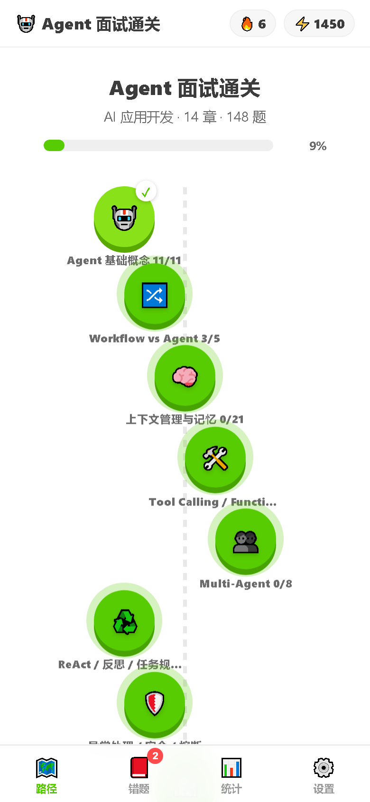 | 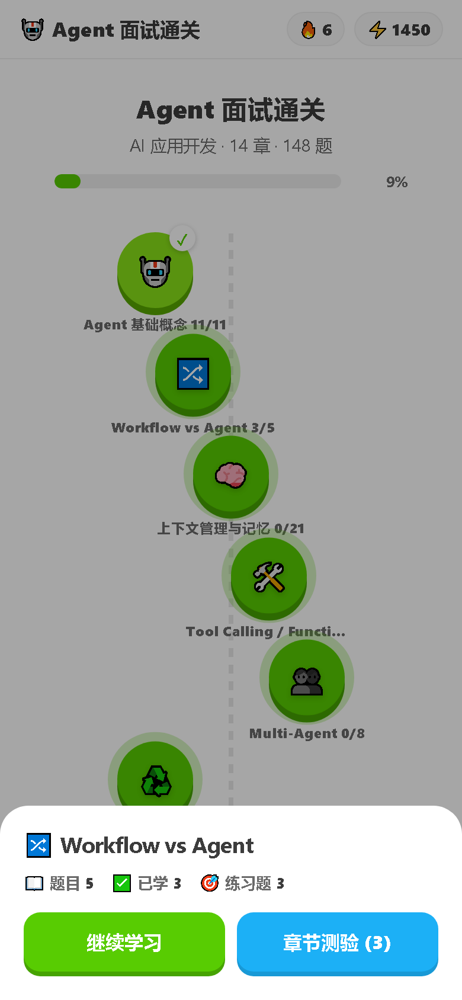 | 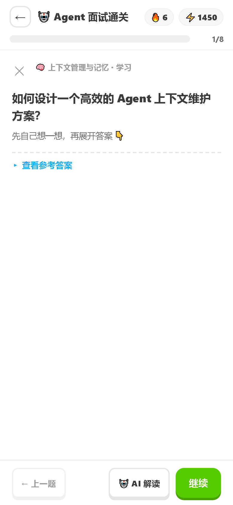 |

| 参考答案 | AI 解读 | 章节测验 |
|:---:|:---:|:---:|
| 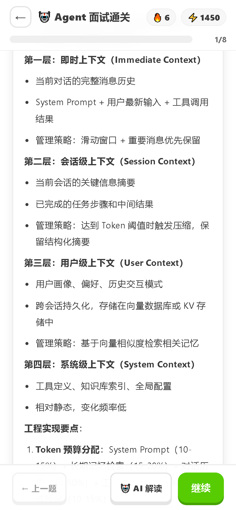 | 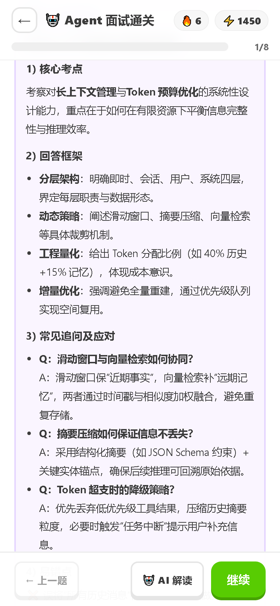 | 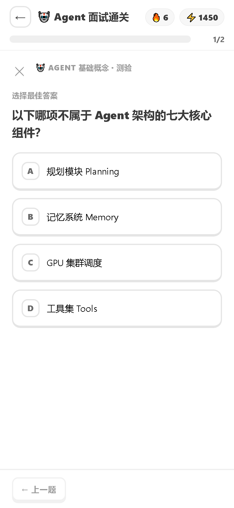 |

| 判题反馈 | 错题本 | 错题详情 |
|:---:|:---:|:---:|
| 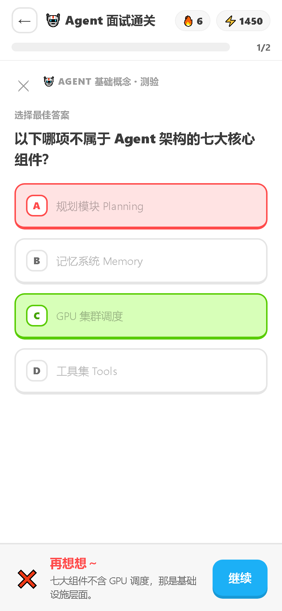 | 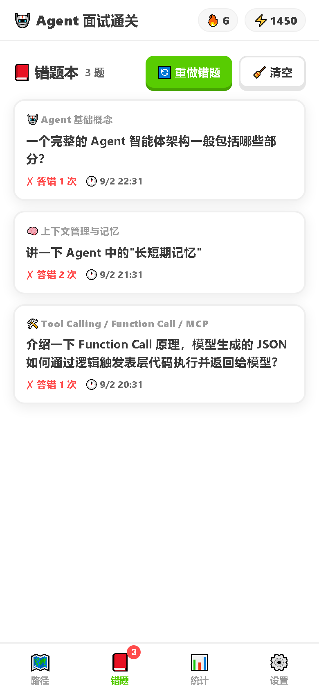 | 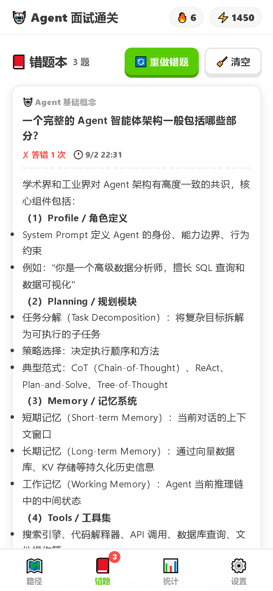 |

| 统计 | 设置 | 暗色模式 |
|:---:|:---:|:---:|
| 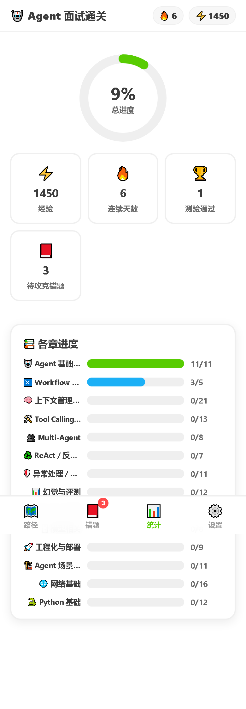 | 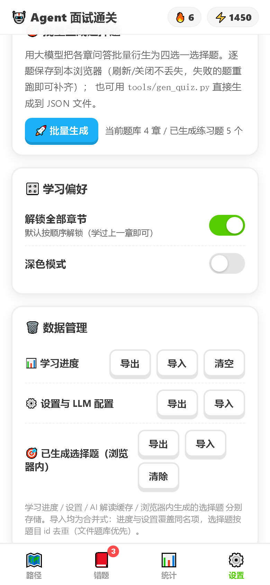 | 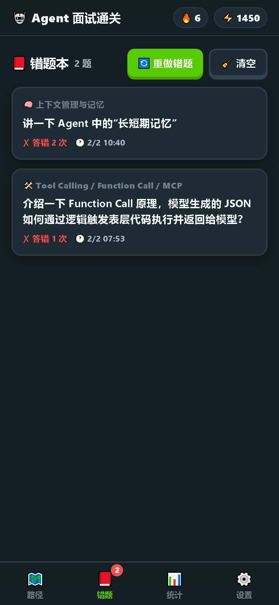 |

## 快速开始

```bash
cd F:/Space/PRO/other/AgentInterview
python -m http.server 8377        # 或任意静态服务器
# 浏览器打开 http://127.0.0.1:8377
```

> 直接双击 index.html（file:// 协议）无法加载 JSON 题库，请务必通过 HTTP 服务访问。

## 功能

- 🗺️ **学习路径**：蛇形章节节点地图，按顺序解锁（学过上一章任意一题即解锁下一章；可在设置中"解锁全部章节"）
- 📖 **学习模式**：每轮 8 题，先想后看——点击"查看参考答案"展开完整 markdown 答案（代码块/表格/图片均渲染）
- 🎯 **章节测验**：四选一选择题，即时判题 + 解析 + 错题展示参考答案；正确率 ≥60% 记为通过
- 🤖 **AI 解读**（可选）：配置任意 OpenAI 兼容 API（baseURL / model / apiKey），学习页一键生成"考点+回答框架+常见追问+易错点"解读
- 🚀 **批量生成选择题**（可选）：
  - 前端：设置页"批量生成"，逐题调用 LLM 生成四选一（内存态，可导出 `gen-quizzes.json` 后用 `tools/apply_gen_quizzes.py` 合并落盘）
  - 终端：`tools/gen_quiz.py` 直接逐题落盘（推荐，断点续跑）
- 📊 **统计**：总进度环、XP、连续学习天数、各章进度条
- ⚙️ **设置**：LLM 配置 + 连通测试、解锁全部章节、深色模式、进度导出/重置

## 题库结构（解耦设计）

```
data/questions/
  _chapters.json          # 章节清单（顺序/图标/描述/文件名）
  agent-基础概念.json      # 每章一个文件，动态增减
  ...
data/assets/              # 答案引用的图片
```

章节文件格式：

```json
{
  "chapter": "agent-基础概念",
  "updated": "auto",
  "questions": [
    {
      "id": "agent-基础概念-1",
      "title": "面试题标题",
      "answer_md": "参考答案（markdown）",
      "quiz": {                // 可选：预生成的四选一
        "stem": "题干",
        "options": ["...", "...", "...", "..."],
        "answer": 0,
        "explain": "一句话解析"
      }
    }
  ]
}
```

### 增删/修改题目

- **改题**：直接编辑对应章节 JSON（title / answer_md / quiz 均可）
- **加题**：往对应章节 JSON 的 `questions` 数组追加对象，并更新 `_chapters.json` 里该章的 `count`
- **加章**：新建 `data/questions/<新章id>.json`，并在 `_chapters.json` 的 `chapters` 数组追加 `{id, file, title, icon, color, desc, count}`
- **删章**：删除文件 + 清单条目
- **从源 markdown 重新抽取**：`python tools/extract_questions.py`（会按旧清单清理再生成；对生成文件的手工修改会丢失，注意先备份 quiz 字段）

### 从源 Markdown 重新抽取

源文档三种结构混排（Agent 主体 `##章/###题`、网络八股 `#题/##小节`、Python 八股 `##题/###小节`），脚本已全部处理：

```bash
python tools/extract_questions.py [源md路径]
```

## LLM 批量生成选择题（终端推荐）

```bash
python tools/gen_quiz.py \
  --base-url http://127.0.0.1:16869/v1 \
  --model qwen38 \
  --api-key sk-xxx \
  --chapters workflow-vs-agent 上下文管理与记忆   # 可选，默认全部
  --limit 5                                      # 可选，每章上限
```

- 逐题落盘、断点续跑（中断后重跑自动跳过已生成）
- `--force` 重新生成已有 quiz
- 生成内容自动清洗：去掉模型自带的 "A)" 选项前缀、校验 answer 索引

## 技术说明

- 纯静态前端（原生 JS + marked.js + DOMPurify，均本地 `lib/`），无构建、无依赖
- 进度保存在浏览器 localStorage（键 `aiinterview.v1`），设置页可导出 JSON 备份
- API Key 仅存本机浏览器，请求直接从浏览器发往所配置的服务（注意跨域：所用 API 需允许浏览器 CORS 访问）
- 适配移动端（viewport 420px 设计基准）与深色模式；对比度已按 WCAG AA 校验

## 目录

```
index.html
css/style.css
js/app.js
lib/               # marked.min.js + dompurify.min.js（本地）
data/questions/    # 题库 JSON（14 章 148 题）
data/assets/       # 答案图片
data/screenshots/  # README 展示用截图（Playwright 生成）
tools/             # extract_questions.py / gen_quiz.py / apply_gen_quizzes.py
```
